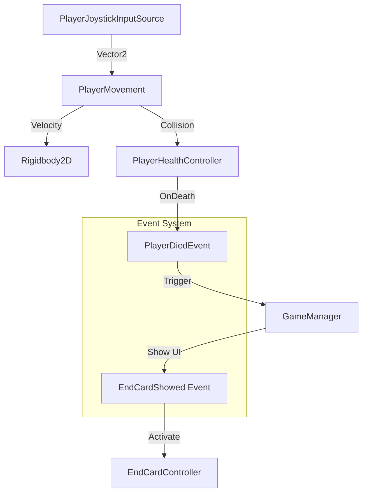

# Fruit Hook
<div align="center">


<br><br>


<br>

*A performance-driven playable ad prototype engineered for stability and rapid iteration.*

<br>

[🕹️ **Play Live Demo**](https://omerozerf.itch.io/fruit-hook)

</div>

---

## 📖 Overview
**Fruit Hook** is a high-performance action prototype designed specifically for the constraints of **playable ads** (Luna/WebGL). Unlike traditional games, this project prioritizes **zero-allocation runtime**, **predictable frame rates**, and **instant startup times**.

The codebase demonstrates a modular, event-driven architecture that decouples logic from data, allowing designers to tune gameplay via `ScriptableObjects` without recompiling code.

### 🎯 Project Goals

| Focus | Description |
| :--- | :--- |
| **Playable-first** | Designed for ad networks and playable runtimes |
| **Performance** | Low CPU / GPU footprint |
| **Iteration speed** | ScriptableObject-driven tuning |
| **Stability** | Luna-compatible architecture |

### ᛦ Branches

| Branch | Purpose |
| :--- | :--- |
| `main` | Core gameplay, no ScratchCard integration |
| `scratch-card-entegration` | Gameplay with ScratchCard erase mechanics |

---

## 🏗️ Architecture
The project follows a **Component-Based** and **Event-Driven** architecture to ensure loose coupling between systems.

### Core Loop Flow


### Event Bus Pattern
The game uses a static, generic `EventBus<T>` to manage communication. This eliminates hard dependencies between unrelated systems (e.g., the `PlayerSystem` doesn't need to know about the `UISystem`).

```csharp
// Example: Decoupled Event Publication
EventBus<PlayerDiedEvent>.Publish(new PlayerDiedEvent(victim: this));
```

### 🧩 Modular System Design

| Module | Responsibility |
| :--- | :--- |
| **Gameplay** | Sword / hook / combat logic |
| **World** | Map & chunk management |
| **Spawning** | Enemy placement logic |
| **Rendering** | Visibility & culling |
| **Scratch** | Erase mechanics (Branch specific) |

Each module is isolated, loosely coupled, and can be disabled independently.

---

## 🛠️ Technical Deep Dive

### 1. Zero-Allocation Object Pooling
To avoid Garbage Collection (GC) spikes—critical for WebGL performance—custom object pooling is implemented for all high-frequency entities (Projectiles, Particles, Enemies).
- **Generic Implementation**: `ObjectPool<T>` handles any `Component`.
- **Pre-warming**: Pools are initialized during loading to prevent runtime instantiation lag.
- **Interface-Driven**: Objects implement `IPoolable` to handle their own reset logic (`OnSpawnedFromPool`, `OnDespawnedToPool`).

### 2. Data-Driven Design (ScriptableObjects)
All gameplay balance data is separated from code logic. This empowers designers to iterate safely.
- **PlayerSettingsSO**: Controls movement speed, drag, and health.
- **EnemySettingsSO**: Defines spawn rates, aggro ranges, and damage.
- **Decoupling**: Systems reference abstract data containers rather than hardcoded values.

### 3. Physics-Based Movement
Reliable interaction is achieved through `Rigidbody2D` manipulation within `FixedUpdate`.
- **Input Smoothing**: Raw input from the virtual joystick is clamped and smoothed before application.
- **Velocity Control**: Instead of modifying `transform.position`, we manipulate velocity to ensure correct collision resolution with the Unity physics engine.
- **Visual Feedback**: A separate `PlayerVisualController` reacts to velocity changes to handle sprite flipping and squashing/stretching via **DOTween**.

### 4. Performance Strategy & Luna Optimizations
The project prioritizes **Update Load Control**. Continuous `Update()` calls are minimized; systems are state-driven and manually triggered.

> **Why No Tilemaps?**
> Initial attempts using Tilemap/MeshRenderer systems proved unstable in Luna. We pivoted to **Manual Tile Spawning** with **Chunk-based Culling**, ensuring off-screen areas incur zero render/update cost.

**Luna Specific Constraints:**
- 🚫 No `AsyncGPUReadback` or `Timeline`.
- 🚫 Minimal LINQ usage to reduce allocations.
- ✅ Custom "Spike-free" collision handling.

### 5. Enemy & Combat Design
- **Sword Orbit System**: Swords rotate around a shared orbit center with decoupled radius parameters. Visual changes do not affect damage logic.
- **Smart Spawning**: Enemies spawn with maximized distance from the player, strictly within bounds, and with overlap prevention to promote clean first frames.

---

## 📂 Project Structure
A clean, modular hierarchy ensures maintainability.

```text
Assets/_Game/_Scripts
├── GameEvents/            # Event Definitions (PlayerDied, LevelComplete)
├── MapSystem/             # Chunk-based world generation logic
├── ObjectPoolSystem/      # Generic Object Pool implementation
├── Patterns/
│   ├── EventBusPattern/   # Core Event Bus logic
│   └── SingletonPattern/  # Managers (Audio, Game)
├── PlayerSystem/          # Modular Player Components (Movement, Health, Anim)
└── ScriptableObjects/     # Configuration Assets
```

---

## 🎨 Content Pipeline

| Asset Type | Tools Used |
| :--- | :--- |
| **Audio** | Audacity |
| **Sprites** | Picsart |
| **Animation** | DOTween (Procedural) |

---

## 🚀 Getting Started

1. **Clone the repo**:
   ```bash
   git clone https://github.com/omerozerf/Fruit-Hook.git
   ```
2. **Open in Unity**:
   - Version: `2022.3.51f1`
3. **Play**:
   - Open `Assets/_Game/Scenes/GameScene.unity` and hit Play.

---

## 📝 Final Notes
This project prioritizes **playable ad realities** over traditional Unity workflows. Visual complexity was intentionally sacrificed in favor of **Stability**, **Performance**, and **Control**. Several Unity conveniences were deliberately avoided to meet these goals.

---

<div align="center">
    
*Developed by [Omer Faruk Ozer](https://www.linkedin.com/in/omerozerf/)*

</div>
